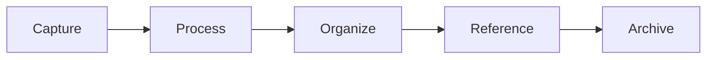
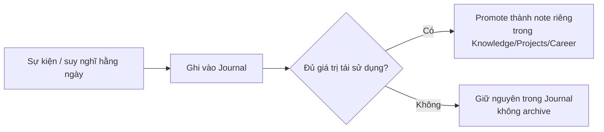
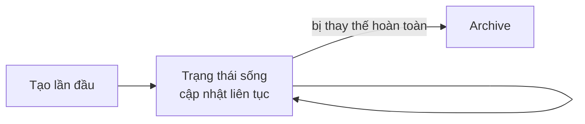
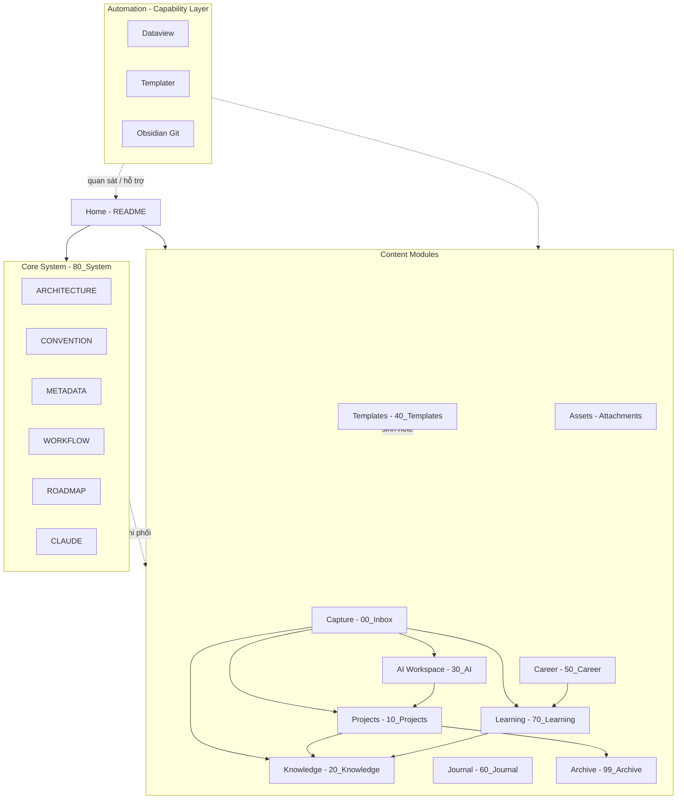
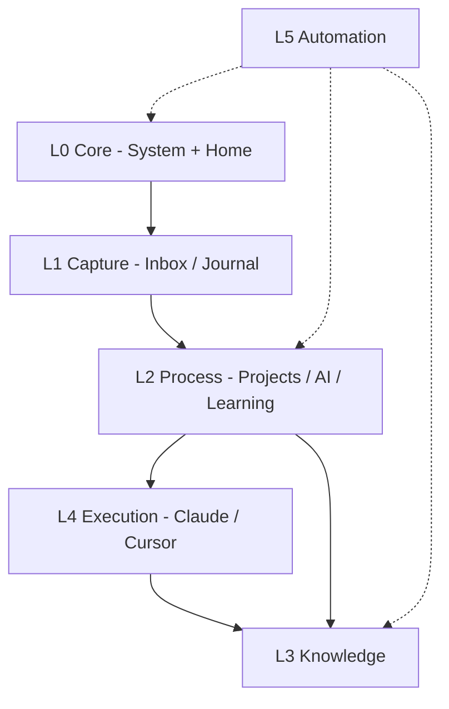
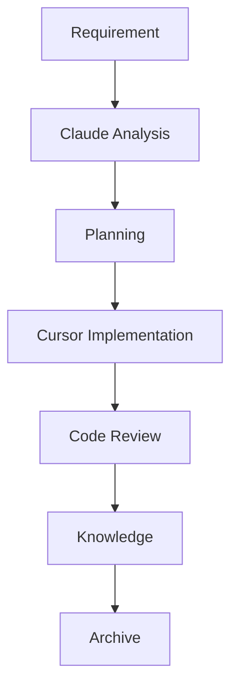
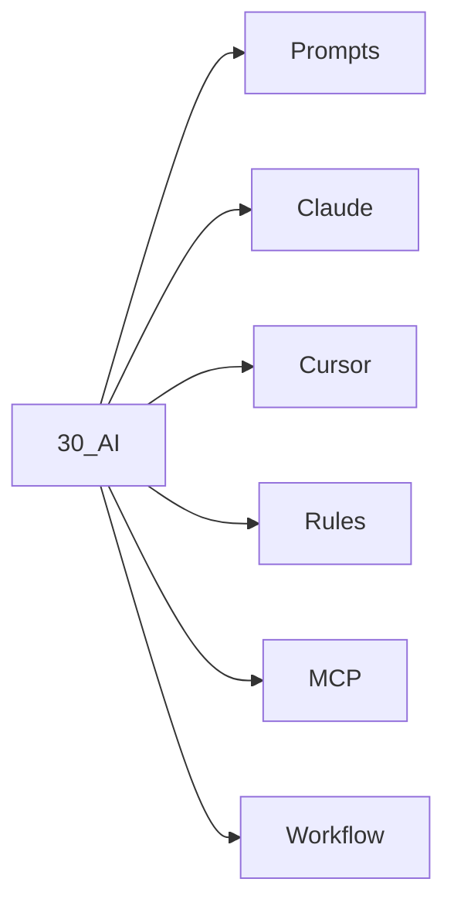

# Architecture Design Document — Developer OS

> **Loại tài liệu:** Architecture Blueprint  
> **Phạm vi:** Toàn bộ nền tảng Developer Operating System  
> **Trạng thái:** v2 — hợp nhất Draft v1 với phần Layer/Lifecycle mở rộng (phiên 2026-07-29)  
> **Không bao gồm:** Template note, README Home, Dataview, YAML mẫu

---

## Mục lục

1. [Tầm nhìn & định vị](#1-tầm-nhìn--định-vị)
2. [Nguyên tắc thiết kế](#2-nguyên-tắc-thiết-kế)
3. [Bản đồ module](#3-bản-đồ-module)
4. [Chi tiết từng module](#4-chi-tiết-từng-module)
5. [Kiến trúc nhiều lớp](#5-kiến-trúc-nhiều-lớp)
6. [Data Flow](#6-data-flow)
7. [Information Lifecycle](#7-information-lifecycle)
8. [Core System](#8-core-system)
9. [Sơ đồ kiến trúc](#9-sơ-đồ-kiến-trúc)
10. [Quan hệ giữa các module](#10-quan-hệ-giữa-các-module)
11. [Roadmap phát triển](#11-roadmap-phát-triển)
12. [Ràng buộc & quyết định mở](#12-ràng-buộc--quyết-định-mở)
13. [Phụ lục — Changelog](#13-phụ-lục--changelog)

---

## 1. Tầm nhìn & định vị

### 1.1 Developer OS là gì

Developer OS là một **Developer Platform** chạy hoàn toàn bằng Markdown, được vận hành trên Obsidian + Git, phục vụ làm việc hàng ngày của một kỹ sư phần mềm làm việc cùng AI (Claude Code, Cursor).

Nó **không phải**:

| Không phải                    | Vì sao                                                                                    |
| ----------------------------- | ----------------------------------------------------------------------------------------- |
| Ứng dụng ghi chú thông thường | Mục tiêu không phải lưu trữ văn bản, mà là vận hành vòng đời tri thức & dự án             |
| Second Brain generic          | Không tối ưu cho "mọi thứ trong đời"; tối ưu cho **software delivery + AI collaboration** |
| Wiki dự án đơn lẻ             | Phải quản lý **nhiều dự án**, career, learning, AI assets đồng thời                       |
| Thư mục tài liệu tĩnh         | Có workflow, lifecycle, automation — vận hành như hệ thống                                |

### 1.2 Giá trị cốt lõi

| Năng lực              | Mô tả                                                |
| --------------------- | ----------------------------------------------------- |
| Multi-project context | Mỗi dự án có không gian ngữ cảnh riêng, không lẫn    |
| Reusable knowledge    | Tri thức tách khỏi dự án để tái dùng                 |
| AI workspace          | Prompt, rules, MCP, workflow AI là tài sản hạng nhất |
| Execution loop        | Từ requirement → code → review → knowledge khép kín  |
| Career & learning     | Phát triển năng lực gắn với thực thi, không tách rời |
| Auditability          | Git làm lịch sử thay đổi của toàn bộ hệ thống        |

### 1.3 Người dùng & ngữ cảnh sử dụng

- **Người dùng chính:** chính bạn — developer / architect làm việc solo hoặc trong team.
- **Công cụ cộng sự:** Claude Code, Cursor, Obsidian, Git.
- **Tần suất:** mở mỗi ngày như Home của hệ điều hành làm việc.

---

## 2. Nguyên tắc thiết kế

| #   | Nguyên tắc                       | Ý nghĩa                                       | Vì sao                                                  |
| --- | --------------------------------- | ---------------------------------------------- | ---------------------------------------------------------- |
| 1   | **Markdown First**               | Mọi nội dung chính là `.md`                   | Portable, diff được, AI đọc được, không vendor lock     |
| 2   | **AI First**                     | AI là cộng sự chính thức, không phải phụ kiện | Prompt/rules/context phải được quản lý như code         |
| 3   | **Git Friendly**                 | Vault = repository                            | Lịch sử, sync, review thay đổi tri thức như review code |
| 4   | **Atomic Notes**                 | Một note = một chủ đề                         | Dễ link, dễ tái dùng, dễ đưa vào AI context             |
| 5   | **Reusable Knowledge**           | Knowledge độc lập với project                 | Tránh mất tri thức khi dự án archive                    |
| 6   | **One Source of Truth**          | Mỗi sự thật chỉ sống ở một nơi                | Giảm trùng lặp; link thay vì copy                       |
| 7   | **Link Everything**              | Wikilink là xương sống                        | Graph = bản đồ phụ thuộc tri thức                       |
| 8   | **Documentation as Code**        | Tài liệu đi cùng vòng đời phần mềm            | Spec, ADR, bug, review là artifact của delivery         |
| 9   | **Separation of Concerns**       | Module tách rõ vai trò                        | Inbox ≠ Knowledge ≠ Archive ≠ AI assets                 |
| 10  | **Home ≠ System**                | README chỉ điều hướng; `80_System` chứa luật  | Tránh Home phình to và lỗi thời                         |
| 11  | **Capture Fast, Organize Later** | Ghi nhanh trước, phân loại sau                | Không mất ý tưởng vì chưa biết đặt đâu                  |
| 12  | **Promote, Don't Duplicate**     | Nâng cấp note theo lifecycle                  | Learning → Knowledge; Project insight → Knowledge       |
| 13  | **Evolutionary Design**          | Không thiết kế hoàn chỉnh ngay từ đầu         | Chỉ bổ sung cấu trúc khi có nhu cầu thực tế lặp lại      |

---

## 3. Bản đồ module

| Module           | Folder chính          | Loại                | Vai trò ngắn                                 |
| ----------------- | ---------------------- | -------------------- | ---------------------------------------------- |
| **Core System**  | `80_System/`          | Content Module      | Luật vận hành, kiến trúc, roadmap            |
| **Capture**      | `00_Inbox/`           | Điểm trung chuyển   | Cổng vào của mọi thông tin thô               |
| **Projects**     | `10_Projects/`        | Content Module      | Ngữ cảnh & artifact theo dự án               |
| **Knowledge**    | `20_Knowledge/`       | Content Module      | Tri thức bền vững, tái sử dụng               |
| **AI Workspace** | `30_AI/`              | Content Module      | Prompt, Claude, Cursor, Rules, MCP, Workflow |
| **Templates**    | `40_Templates/`       | Artifact storage     | Khuôn mẫu tạo note (không chứa nội dung)     |
| **Career**       | `50_Career/`          | Content Module      | Mục tiêu nghề nghiệp, review, narrative      |
| **Journal**      | `60_Journal/`         | Content Module      | Reflection theo thời gian                    |
| **Learning**     | `70_Learning/`        | Content Module      | Lộ trình học, note đang học                  |
| **Archive**      | `99_Archive/`         | Điểm trung chuyển   | Đóng băng nội dung không còn active          |
| **Assets**       | `Attachments/`        | Shared storage       | Binary / file đính kèm                       |
| **Automation**   | *(không có folder riêng)* | **Capability Layer** | Dataview, Templater, Git sync — xuyên suốt   |
| **Home**         | `README.md`           | Interface Layer      | Cửa vào điều hướng — không chứa luật dài     |

> **Đã hoàn thành:** thư mục gốc đã đổi tên `30_Prompts` → `30_AI` (2026-07-29). Cấu trúc tiểu module bên trong (`Prompts/`, `Claude/`, `Cursor/`, `Rules/`, `MCP/`, `Workflow/`) vẫn chưa tạo — thuộc Phase 3 của Roadmap (§11, xem §4.5).

### 3.1 Content Module vs Capability Layer

Đây là một phân biệt kiến trúc quan trọng, không chỉ là cách gọi tên: **Content Module** sở hữu nội dung thật, có ranh giới rõ ràng, ánh xạ vào một thư mục cụ thể (Projects, Knowledge, AI Workspace...). **Capability Layer** không sở hữu nội dung — nó là năng lực vận hành *trên* nội dung của các module khác.

- **Automation** là Capability Layer thuần túy: Dataview, Templater, Git hook không tạo ra tri thức, chỉ đọc/hiển thị/tự động hóa những gì đã có ở nơi khác. Vì vậy nó không có thư mục riêng.
- **AI Workspace** (`30_AI`) là trường hợp **kép**: nó vừa là Content Module (sở hữu prompt, rules, MCP notes — tài sản thật, có lifecycle riêng) vừa cấp một **năng lực xuyên suốt** (AI hỗ trợ thực thi trong Projects, tổng hợp trong Knowledge, ôn tập trong Learning). Nói cách khác: *nội dung AI có nhà (`30_AI`), nhưng năng lực AI thì không bị giới hạn trong nhà đó.*

Phân biệt này giúp tránh một câu hỏi sai thường gặp: *"ghi chú này thuộc Knowledge hay AI Workspace?"* — câu trả lời luôn là nó thuộc **Content Module phù hợp với bản chất nội dung** (kỹ thuật → Knowledge, prompt đã tinh chỉnh → AI Workspace), còn việc AI có tham gia tạo ra nội dung đó hay không là chuyện của Capability Layer, không quyết định nơi lưu trữ.

---

## 4. Chi tiết từng module

### 4.1 Core System

| Thuộc tính          | Mô tả                                                                                             |
| -------------------- | ---------------------------------------------------------------------------------------------------- |
| **Mục tiêu**        | Định nghĩa "luật chơi" của toàn bộ Developer OS                                                   |
| **Vai trò**         | Single source of truth cho convention, workflow, metadata, roadmap, AI operating guide            |
| **Dữ liệu quản lý** | Architecture, convention, metadata schema, workflow chuẩn, roadmap, Claude/Cursor operating notes |
| **Loại note**       | Tài liệu hệ thống (ADD, CONVENTION, WORKFLOW, …) — ít thay đổi, độ ưu tiên cao                    |
| **Folder**          | `80_System/`                                                                                      |
| **Quan hệ**         | Chi phối mọi module khác; Home chỉ link tới đây                                                   |
| **Khi nào dùng**    | Khi thiết kế/thay đổi quy ước, onboarding bản thân sau gián đoạn, trước khi mở rộng hệ thống      |

---

### 4.2 Capture (Inbox)

| Thuộc tính          | Mô tả                                                              |
| -------------------- | -------------------------------------------------------------------- |
| **Mục tiêu**        | Thu nhận thông tin với ma sát thấp nhất                            |
| **Vai trò**         | Buffer tạm — không phải kho lưu trữ                                |
| **Dữ liệu quản lý** | Ý tưởng thô, clip, câu hỏi, bug vừa gặp, insight AI chưa phân loại |
| **Loại note**       | Scratch, draft, inbox item                                         |
| **Folder**          | `00_Inbox/`                                                        |
| **Quan hệ**         | Đầu vào → Projects / Knowledge / AI / Learning / Journal / Archive |
| **Khi nào dùng**    | Ngay khi có thông tin, chưa chắc thuộc module nào                  |

---

### 4.3 Projects

| Thuộc tính          | Mô tả                                                                                          |
| -------------------- | -------------------------------------------------------------------------------------------------- |
| **Mục tiêu**        | Quản lý ngữ cảnh và artifact của từng dự án đang active                                        |
| **Vai trò**         | Không gian làm việc theo project — delivery-oriented                                           |
| **Dữ liệu quản lý** | Requirement/SRS, planning, decision (ADR), bug, meeting, review notes, context pack cho AI     |
| **Loại note**       | Project README, SRS, Decision, Bug, Plan, Review, Meeting                                      |
| **Folder**          | `10_Projects/<ten-du-an>/`                                                                     |
| **Quan hệ**         | Nhận từ Capture; dùng AI Workspace để thực thi; xuất tri thức sang Knowledge; đóng vào Archive |
| **Khi nào dùng**    | Mọi công việc gắn với một sản phẩm / codebase / initiative cụ thể                              |

---

### 4.4 Knowledge

| Thuộc tính          | Mô tả                                                                                       |
| -------------------- | ------------------------------------------------------------------------------------------- |
| **Mục tiêu**        | Tích lũy tri thức bền vững, độc lập dự án                                                   |
| **Vai trò**         | Thư viện tái sử dụng — pattern, how-to, concept, glossary                                   |
| **Dữ liệu quản lý** | Atomic knowledge, pattern, troubleshooting đã chắt lọc, glossary, cheat-sheet               |
| **Loại note**       | Concept, Pattern, How-to, Comparison, Glossary entry                                        |
| **Folder**          | `20_Knowledge/` (có thể chia domain sau)                                                    |
| **Quan hệ**         | Nhận từ Projects / Learning / Review; được AI Workspace tham chiếu; Career có thể trích dẫn |
| **Khi nào dùng**    | Khi insight đã ổn định và có khả năng dùng lại ở dự án khác                                 |

---

### 4.5 AI Workspace

| Thuộc tính          | Mô tả                                                                                 |
| -------------------- | --------------------------------------------------------------------------------------- |
| **Mục tiêu**        | Quản lý toàn bộ tài sản cộng tác với AI như một "AI platform nội bộ"                  |
| **Vai trò**         | Nơi chuẩn hóa cách nói chuyện với Claude Code & Cursor — đồng thời là Content Module gốc của Capability Layer "AI Integration" (xem §3.1) |
| **Dữ liệu quản lý** | Prompt library, Claude guides, Cursor rules/snippets, MCP configs notes, AI workflows |
| **Loại note**       | Prompt, Rule, Agent guide, MCP note, AI workflow                                      |
| **Folder**          | `30_AI/` với cấu trúc mục tiêu:                                                       |

```text
30_AI/
├── Prompts/      # Prompt đã tinh chỉnh, có mục đích rõ
├── Claude/       # Cách vận hành Claude Code trong OS này
├── Cursor/       # Rules, context, cách dùng Cursor
├── Rules/        # Quy tắc dùng chung cho AI agents
├── MCP/          # Ghi chú MCP servers / tools
└── Workflow/     # Chuỗi bước AI lặp lại được
```

| **Quan hệ** | Cung cấp năng lực thực thi cho Projects; nhận cải tiến từ Review; đồng bộ tinh thần với Core (`CLAUDE`) |
| **Khi nào dùng** | Trước và trong mọi session AI có mục tiêu rõ |

---

### 4.6 Templates

| Thuộc tính          | Mô tả                                                          |
| -------------------- | ------------------------------------------------------------------ |
| **Mục tiêu**        | Giảm ma sát tạo note đúng cấu trúc                             |
| **Vai trò**         | Khuôn — không chứa tri thức thật                               |
| **Dữ liệu quản lý** | Template skeletons (SRS, Bug, Decision, Knowledge, Journal, …) |
| **Loại note**       | Template only                                                  |
| **Folder**          | `40_Templates/`                                                |
| **Quan hệ**         | Phục vụ Capture / Projects / Knowledge / Journal / Learning    |
| **Khi nào dùng**    | Khi tạo note thuộc loại đã chuẩn hóa                           |

---

### 4.7 Career

| Thuộc tính          | Mô tả                                                                    |
| -------------------- | ---------------------------------------------------------------------------- |
| **Mục tiêu**        | Định hướng nghề nghiệp dài hạn và đo tiến bộ                             |
| **Vai trò**         | Lớp chiến lược cá nhân — không lẫn task hàng ngày                        |
| **Dữ liệu quản lý** | Goal, skill map, quarterly review, portfolio narrative, interview prep   |
| **Loại note**       | Goal, Review, Narrative, Skill track                                     |
| **Folder**          | `50_Career/`                                                             |
| **Vòng đời**        | Reference-based — xem §7.4                                              |
| **Quan hệ**         | Nhận tín hiệu từ Learning & Projects; định hướng Current Focus trên Home |
| **Khi nào dùng**    | Review định kỳ (tháng/quý) hoặc khi đổi hướng nghề                       |

---

### 4.8 Journal

| Thuộc tính          | Mô tả                                                                    |
| -------------------- | ---------------------------------------------------------------------------- |
| **Mục tiêu**        | Ghi reflection theo thời gian — đóng loop nhận thức                      |
| **Vai trò**         | Nhật ký vận hành cá nhân, không thay Knowledge                           |
| **Dữ liệu quản lý** | Daily/weekly reflection, blockers, mood/energy (nếu cần), quyết định mềm |
| **Loại note**       | Daily journal, Weekly review                                             |
| **Folder**          | `60_Journal/`                                                            |
| **Vòng đời**        | Log-based — xem §7.3                                                    |
| **Quan hệ**         | Có thể sinh Capture mới; đôi khi promote sang Knowledge / Career         |
| **Khi nào dùng**    | Cuối ngày / cuối tuần                                                    |

---

### 4.9 Learning

| Thuộc tính          | Mô tả                                                                         |
| -------------------- | ----------------------------------------------------------------------------------- |
| **Mục tiêu**        | Quản lý quá trình học — chưa phải tri thức ổn định                            |
| **Vai trò**         | Sandbox học tập có lộ trình                                                   |
| **Dữ liệu quản lý** | Learning track, course notes, experiment log, reading list                    |
| **Loại note**       | Track, Lesson note, Experiment, Summary (draft)                               |
| **Folder**          | `70_Learning/`                                                                |
| **Quan hệ**         | Input từ Career focus; output promote → Knowledge khi đã hiểu & tái dùng được |
| **Khi nào dùng**    | Khi đang học skill/domain mới (React, Java, AI Engineering, Japanese, …)      |

---

### 4.10 Archive

| Thuộc tính          | Mô tả                                                               |
| -------------------- | ------------------------------------------------------------------- |
| **Mục tiêu**        | Giữ lịch sử mà không làm bẩn không gian active                      |
| **Vai trò**         | Cold storage có tổ chức                                             |
| **Dữ liệu quản lý** | Dự án đóng, note lỗi thời, learning track hoàn tất không cần active |
| **Loại note**       | Bất kỳ — đã đánh dấu archived                                       |
| **Folder**          | `99_Archive/`                                                       |
| **Quan hệ**         | Điểm cuối của Flow-based lifecycle và của Reference-based khi bị thay thế hoàn toàn; vẫn có thể link ngược từ Knowledge nếu cần |
| **Khi nào dùng**    | Khi project/note không còn trong vòng thực thi                      |

---

### 4.11 Assets

| Thuộc tính          | Mô tả                                         |
| -------------------- | ------------------------------------------------ |
| **Mục tiêu**        | Tách binary khỏi Markdown                     |
| **Vai trò**         | Kho đính kèm                                  |
| **Dữ liệu quản lý** | Ảnh, PDF, dump file                           |
| **Folder**          | `Attachments/`                                |
| **Quan hệ**         | Được link từ mọi module nội dung              |
| **Khi nào dùng**    | Khi note cần media / file không phải Markdown |

---

### 4.12 Automation (Capability Layer)

| Thuộc tính             | Mô tả                                                                                                          |
| ------------------------ | ------------------------------------------------------------------------------------------------------------------ |
| **Mục tiêu**           | Giảm cập nhật thủ công, giữ Home/Dashboard luôn đúng                                                           |
| **Vai trò**            | Capability Layer thuần túy — không sở hữu nội dung, không có folder riêng (xem §3.1)                          |
| **Thành phần dự kiến** | Templater (tạo note), Dataview (Active Project, Open Tasks, Recent Notes, Learning, Last Commit), Obsidian Git |
| **Quan hệ**            | Đọc metadata từ mọi module; hiển thị trên Home                                                                 |
| **Khi nào dùng**       | Sau khi Convention + Metadata ổn định (Phase Dashboard / Automation)                                           |

---

### 4.13 Home

| Thuộc tính        | Mô tả                                                        |
| ------------------- | ------------------------------------------------------------ |
| **Mục tiêu**      | Cửa vào 30 giây mỗi ngày                                     |
| **Vai trò**       | Điều hướng + focus + quick actions — **không** chứa luật dài |
| **Folder / file** | `README.md` (root)                                           |
| **Quan hệ**       | Link tới mọi module; ủy quyền chi tiết cho Core System       |
| **Khi nào dùng**  | Mỗi lần mở Obsidian                                           |

---

## 5. Kiến trúc nhiều lớp

### 5.1 Tổng quan các layer

```text
┌─────────────────────────────────────────────┐
│  L5  Automation     Dataview · Git · Hooks  │
├─────────────────────────────────────────────┤
│  L4  Execution      Claude · Cursor · Code  │
├─────────────────────────────────────────────┤
│  L3  Knowledge      Knowledge · Learning*   │
├─────────────────────────────────────────────┤
│  L2  Process        Projects · AI Workspace │
├─────────────────────────────────────────────┤
│  L1  Capture        Inbox · Journal (raw)   │
├─────────────────────────────────────────────┤
│  L0  Core           80_System · Home        │
└─────────────────────────────────────────────┘
* Learning thuộc Process khi đang học; promote lên Knowledge khi ổn định.
```

### 5.2 Giải thích từng layer

| Layer  | Tên        | Mục tiêu                                   | Thành phần chính                                 |
| ------ | ---------- | ---------------------------------------------- | -------------------------------------------------- |
| **L0** | Core       | Định luật & cửa vào                        | `80_System`, `README.md`                         |
| **L1** | Capture    | Thu nhận thô                               | `00_Inbox`, một phần `60_Journal`                |
| **L2** | Process    | Biến thông tin thành công việc có cấu trúc | `10_Projects`, `30_AI`, `70_Learning` (đang học) |
| **L3** | Knowledge  | Chắt lọc thành tài sản tái dùng            | `20_Knowledge`, Learning đã promote              |
| **L4** | Execution  | Thực thi bằng AI + IDE                     | Claude Code, Cursor, dùng artifacts từ L2/L3     |
| **L5** | Automation | Quan sát & giảm thao tác tay               | Dataview, Templater, Obsidian Git                |

### 5.3 Luồng dữ liệu qua các layer

1. **L0** quy định convention → mọi layer tuân thủ cùng "ngôn ngữ".
2. Thông tin vào **L1** (Capture) với chi phí thấp.
3. **L2** gán ngữ cảnh: thuộc project nào, cần AI gì, đang học gì.
4. Thực thi xảy ra ở **L4**, đọc context từ L2 + L3 + AI Workspace.
5. Kết quả ổn định được promote lên **L3**.
6. **L5** quan sát trạng thái (task mở, note mới, commit) và phản chiếu lên Home.
7. Kết thúc vòng đời → Archive (ngoài pipeline active, vẫn thuộc hệ thống).

Career nằm **cạnh** pipeline (strategic overlay): định hướng focus cho L2/L3, không nằm trên đường critical path của một feature.

### 5.4 Hai lăng kính bổ sung nhau

Mô hình layer (L0–L5) ở trên mô tả **pipeline theo thời gian** — thông tin di chuyển qua các giai đoạn nào. Phân loại Content Module vs Capability Layer ở §3.1 mô tả **bản chất sở hữu nội dung** của từng thành phần. Hai lăng kính không mâu thuẫn: Automation (L5) là Capability Layer thuần túy; AI Workspace vừa là Content Module nằm ở L2/L3 (sở hữu prompt, rules), vừa cấp năng lực cho L4 Execution.

---

## 6. Data Flow

### 6.1 Luồng delivery chuẩn (Developer Workflow)

```text
Requirement
      │
      ▼
Claude          ← AI Analysis / làm rõ / sinh hướng tiếp cận
      │
      ▼
Planning        ← SRS, plan, ADR sơ bộ trong Projects
      │
      ▼
Cursor          ← Implementation với rules/prompts từ AI Workspace
      │
      ▼
Code Review     ← Review notes, checklist, lesson
      │
      ▼
Knowledge       ← Promote pattern / how-to / decision đã chốt
      │
      ▼
Archive         ← Đóng feature/project khi hết active
```

### 6.2 Giải thích từng bước

| Bước            | Mục tiêu                                     | Artifact điển hình            | Module chạm                            |
| ----------------- | ----------------------------------------------- | -------------------------------- | ----------------------------------------- |
| **Requirement** | Khóa vấn đề cần giải                         | Problem statement, SRS draft  | Projects, đôi khi Inbox                |
| **Claude**      | Phân tích, mở rộng option, giảm mù thông tin | Analysis note, clarifying Q&A | AI Workspace + Projects                |
| **Planning**    | Chọn hướng, chia việc, ghi quyết định        | Plan, ADR, task breakdown     | Projects                               |
| **Cursor**      | Hiện thực hóa trong codebase                 | Diff, implementation notes    | AI Workspace (Cursor/Rules) + Projects |
| **Code Review** | Kiểm chất lượng & học từ thay đổi            | Review note, bug nếu có       | Projects → có thể Capture bug          |
| **Knowledge**   | Tách phần tái dùng khỏi project              | Atomic knowledge, pattern     | Knowledge                              |
| **Archive**     | Dọn không gian active                        | Folder/project archived       | Archive                                |

### 6.3 Luồng phụ: Learning

```text
Career Focus → Learning Track → Practice (Projects/AI) → Promote → Knowledge
```

### 6.4 Luồng phụ: AI asset improvement

```text
Session AI → Review chất lượng output → Cập nhật Prompt/Rules/Workflow trong 30_AI
```

---

## 7. Information Lifecycle

Một lifecycle chung cho mọi loại nội dung sẽ gượng ép: Journal ghi liên tục và không bao giờ "đóng" như một khối, còn Career/Core là hồ sơ sống, cập nhật liên tục thay vì đi qua một chu trình có kết thúc. Vì vậy hệ thống tách 3 loại vòng đời.

### 7.1 Ba loại vòng đời

| Loại               | Áp dụng cho                          | Đặc điểm                                              |
| -------------------- | -------------------------------------- | -------------------------------------------------------- |
| **Flow-based**     | Projects, Knowledge, Learning         | Có điểm bắt đầu và kết thúc rõ ràng, kết thúc bằng Archive |
| **Log-based**      | Journal                               | Append-only theo thời gian, không archive theo khối    |
| **Reference-based** | Career, Core System                   | Trạng thái sống, cập nhật liên tục, chỉ archive khi bị thay thế hoàn toàn |

### 7.2 Flow-based Lifecycle — chi tiết từng giai đoạn



| Giai đoạn     | Mục tiêu                      | Câu hỏi kiểm tra                               | Kết quả mong muốn                |
| --------------- | -------------------------------- | -------------------------------------------------- | ----------------------------------- |
| **Capture**   | Không mất thông tin           | "Ghi được trong < 30 giây?"                    | Note thô trong Inbox / Journal   |
| **Process**   | Gán nghĩa & ngữ cảnh          | "Thuộc project / learning / AI / career?"      | Note đã có chỗ đứng module       |
| **Organize**  | Chuẩn hóa cấu trúc & liên kết | "Đúng loại note? Có wikilink? Có metadata đủ?" | Note searchable, linkable        |
| **Reference** | Sẵn sàng tái sử dụng          | "Có thể đưa vào AI context hoặc dự án khác?"   | Knowledge / Prompt / ADR ổn định |
| **Archive**   | Giữ lịch sử, giảm nhiễu       | "Còn trong vòng thực thi không?"               | Active space sạch                |

### 7.3 Log-based Lifecycle — Journal



Journal không chuyển sang `99_Archive` như một khối. Chỉ những phần đủ giá trị mới được tách ra thành note atomic ở module khác (áp dụng nguyên tắc *Promote, Don't Duplicate*).

### 7.4 Reference-based Lifecycle — Career & Core



Career (CV, mục tiêu nghề nghiệp) và Core System (nguyên tắc, convention) chỉ archive khi có phiên bản mới thay thế hoàn toàn — không theo chu kỳ review định kỳ như Flow-based.

### 7.5 Quy tắc promote

| Từ                             | Sang      | Điều kiện                             |
| --------------------------------- | ----------- | ---------------------------------------- |
| Inbox                          | Projects  | Gắn được với dự án cụ thể             |
| Inbox                          | Knowledge | Đã là insight ổn định, tái dùng được  |
| Learning                       | Knowledge | Đã hiểu và áp dụng được ít nhất 1 lần |
| Projects (decision/bug lesson) | Knowledge | Bài học không còn phụ thuộc project   |
| Journal                        | Knowledge / Projects / Career | Đủ giá trị tái sử dụng, không còn là ghi chép rời rạc |
| Bất kỳ (active chết)           | Archive   | Không còn trong vòng thực thi         |

**Cấm:** copy nguyên note sang nhiều nơi. Prefer link + promote (di chuyển hoặc tách atomic note mới).

---

## 8. Core System

Các thành phần tài liệu nền trong `80_System/`:

| File                           | Vai trò                                                         |
| --------------------------------- | -------------------------------------------------------------------- |
| **ARCHITECTURE** (file này)    | Blueprint tổng thể — module, layer, flow, lifecycle             |
| **CLAUDE**                     | Operating guide khi làm việc với Claude Code trong Developer OS |
| **CONVENTION**                 | Quy ước đặt tên, folder, linking, atomic note, chống trùng lặp  |
| **METADATA**                   | Schema frontmatter/tags — hợp đồng dữ liệu cho Dataview sau này |
| **WORKFLOW**                   | Mô tả chi tiết Developer Workflow & nhánh phụ                   |
| **ROADMAP**                    | Lộ trình xây dựng hệ thống theo phase                           |
| _(tùy chọn sau)_ **GLOSSARY**  | Thuật ngữ nội bộ OS                                             |
| _(tùy chọn sau)_ **DECISIONS** | ADR cấp hệ thống (quyết định về chính OS)                       |

### 8.1 Phân ranh giới Home vs Core

| Home (`README.md`)    | Core (`80_System/`)               |
| ------------------------ | ------------------------------------ |
| Điều hướng            | Luật & thiết kế                   |
| Current Focus (ngắn)  | Giải thích vì sao / cách vận hành |
| Quick Actions         | Workflow đầy đủ                   |
| Placeholder Dashboard | Metadata schema, roadmap chi tiết |
| Đọc trong 30 giây     | Đọc khi thiết kế / onboarding lại |

---

## 9. Sơ đồ kiến trúc

### 9.1 Module map



### 9.2 Layer view



### 9.3 Data flow delivery



### 9.4 Information lifecycle (3 loại)

Xem sơ đồ chi tiết từng loại ở §7.2 (Flow-based), §7.3 (Log-based), §7.4 (Reference-based).

### 9.5 AI Workspace nội bộ



---

## 10. Quan hệ giữa các module

| Từ → Đến                                 | Kiểu quan hệ  | Ý nghĩa                                      |
| ------------------------------------------- | --------------- | ----------------------------------------------- |
| Core → \*                                | Governs       | Mọi module tuân convention/metadata/workflow |
| Home → \*                                | Navigates     | Điều hướng, không sở hữu nội dung            |
| Capture → Projects/Knowledge/AI/Learning | Feeds         | Phân phối thông tin thô                      |
| Projects ↔ AI Workspace                  | Executes with | AI thực thi trong ngữ cảnh project           |
| Projects → Knowledge                     | Promotes      | Tách tri thức tái dùng                       |
| Learning → Knowledge                     | Promotes      | Học xong → tài sản bền                       |
| Career → Learning / Focus                | Directs       | Chiến lược định hướng học & ưu tiên          |
| Journal → Capture/Career/Knowledge       | Reflects      | Reflection có thể sinh action/insight        |
| \* → Archive                             | Retires       | Kết thúc vòng active                         |
| Templates → \*                           | Scaffolds     | Sinh cấu trúc note                           |
| Automation → Home/Projects               | Observes      | Dashboard không cập nhật tay                 |
| Assets ↔ \*                              | Supports      | Đính kèm media                               |

---

## 11. Roadmap phát triển

Nguyên tắc roadmap: **nền trước, thực thi sau, tự động hóa cuối** — không xây Dashboard trước khi có Metadata.

### Phase 1 — Foundation

- Khóa cấu trúc folder mục tiêu (`30_AI`, `80_System`)
- Hoàn thiện Core docs: ARCHITECTURE, CONVENTION, METADATA, WORKFLOW, ROADMAP, CLAUDE
- Tách Home khỏi tài liệu dài (đã bắt đầu)
- Git hygiene cơ bản

**Done khi:** mọi module có định nghĩa rõ; convention viết xong; Home chỉ còn cửa vào.

### Phase 2 — Knowledge

- ~~Chuẩn hóa atomic note & linking~~ — xong, xem `CONVENTION.md` §3 và §5
- ~~Quy tắc promote Learning/Projects → Knowledge~~ — xong, xem `CONVENTION.md` §7.5
- ~~Phân domain Knowledge (nếu cần)~~ — quyết định Flat mặc định, xem `CONVENTION.md` §9
- ~~Dọn Inbox aging~~ — chính sách xong, xem `WORKFLOW.md` §2

**Done khi:** Knowledge có thể dùng làm AI context đáng tin. Chính sách đã đầy đủ; tiêu chí này chỉ đạt được qua sử dụng thực tế theo thời gian, không phải qua viết thêm tài liệu.

### Phase 3 — AI Workspace

- Đổi/tái cấu trúc `30_Prompts` → `30_AI/{Prompts,Claude,Cursor,Rules,MCP,Workflow}`
- Catalog prompt theo mục đích (review, SRS, debug, …)
- Đồng bộ tinh thần `80_System/CLAUDE` với thư mục `30_AI/Claude`
- Context pack theo project

**Done khi:** mở session Claude/Cursor luôn biết lấy prompt/rules ở đâu.

### Phase 4 — Projects

- Chuẩn hóa cấu trúc trong `10_Projects/<project>/`
- Vòng Requirement → … → Archive chạy thật trên 1–2 dự án
- ADR + Bug + Review như artifact bắt buộc của delivery

**Done khi:** một dự án mẫu vận hành end-to-end theo Data Flow.

### Phase 5 — Dashboard

- Metadata đủ để query
- Dataview trên Home: Active Project, Open Tasks, Recent Notes, Learning, Last Commit
- Bỏ hoàn toàn cập nhật tay phần "Hôm nay"

**Done khi:** Home không bao giờ lỗi thời vì quên update.

### Phase 6 — Automation

- Templater folder templates
- Git commit convention / định kỳ
- Hook nhẹ (nếu cần)
- Orphan note review, archive review định kỳ

**Done khi:** ma sát vận hành hàng ngày thấp; OS "tự chạy" phần quan sát.

---

## 12. Ràng buộc & quyết định mở

### 12.1 Ràng buộc cứng

- Markdown only cho nội dung chính
- Không để luật dài trong README
- Không nhân bản sự thật (One Source of Truth)
- AI output chỉ vào vault khi đã xác thực / chỉnh sửa
- Archive thay vì xóa (trừ nhiễu Inbox vô giá trị)

### 12.2 Quyết định mở (chốt ở phase sau)

| Chủ đề             | Câu hỏi còn mở                                             |
| --------------------- | -------------------------------------------------------------- |
| Metadata schema    | Field bắt buộc tối thiểu cho project/task/knowledge?       |
| Project skeleton   | Bộ file mặc định trong mỗi `10_Projects/<name>/`? (default tạm: chỉ `README.md`, xem CONVENTION §9) |
| Knowledge taxonomy | Flat vs domain folders vs MOC? (default tạm: Flat, xem CONVENTION §9) |
| Multi-device sync  | Remote Git nào, nhánh nào?                                 |
| Publish            | Có xuất subset Knowledge ra ngoài không?                   |

### 12.3 Quyết định đã chốt

| Chủ đề                              | Quyết định                                                                 | Phiên |
| -------------------------------------- | ------------------------------------------------------------------------------ | --- |
| Automation / AI là module hay layer? | Automation là Capability Layer thuần túy; AI Workspace là Content Module kép — vừa sở hữu nội dung vừa cấp năng lực xuyên suốt (§3.1) | 2026-07-29 |
| Một lifecycle chung hay nhiều loại?  | Tách 3 loại: Flow-based, Log-based, Reference-based (§7.1)                 | 2026-07-29 |
| Naming convention                   | kebab-case cho note nội dung; ngoại lệ Journal (date), Templates (Title Case), file hệ thống (UPPERCASE) — xem CONVENTION §2 | 2026-07-29 |
| Tag strategy                        | Hầu như không dùng tag — dựa vào folder + wikilink; ngoại lệ hẹp `#draft` — xem CONVENTION §6 | 2026-07-29 |

---

## Kết luận

Developer OS được thiết kế như một **nền tảng Markdown** với:

- **Module hóa rõ ràng** — mỗi khu vực một trách nhiệm, phân biệt rõ Content Module và Capability Layer
- **Phân lớp** — từ Core → Capture → Process → Knowledge → Execution → Automation
- **Data Flow delivery** gắn Claude & Cursor vào vòng đời phần mềm
- **Information Lifecycle** phân theo 3 loại (Flow/Log/Reference-based), chống phình Inbox và chống mất tri thức
- **Core System** là nơi chứa luật; **Home** chỉ là cửa vào

Tài liệu này là nền để triển khai lần lượt: Convention → Metadata → Workflow chi tiết → AI Workspace → Projects chuẩn → Dashboard → Automation.

---

## 13. Phụ lục — Changelog

| Phiên bản | Ngày | Thay đổi |
| --- | --- | --- |
| v1 | trước 2026-07-29 | Bản Draft đầu tiên: tầm nhìn, 12 nguyên tắc, 13 module chi tiết, layer L0–L5, Data Flow, Information Lifecycle (5 giai đoạn), Roadmap 6 phase |
| v2 | 2026-07-29 | Hợp nhất với bản thảo luận trong phiên: chính thức hóa phân biệt Content Module vs Capability Layer (§3.1); tách Information Lifecycle thành 3 loại Flow/Log/Reference-based (§7); bổ sung §5.4 đối chiếu hai lăng kính Layer và Content/Capability; thêm §12.3 ghi nhận quyết định đã chốt |
| v2.1 | 2026-07-29 | Đổi tên thư mục `30_Prompts` → `30_AI` trong vault để khớp kiến trúc; cập nhật ghi chú chuyển tiếp ở §3 |
| v2.2 | 2026-07-29 | Chốt Naming convention và Tag strategy (§12.3), chuyển từ Quyết định mở sang đã chốt; liên kết với `CONVENTION.md` mới viết |
| v2.3 | 2026-07-29 | Đánh dấu Phase 2 — Knowledge: 3/4 mục đã xong từ Phase 1 (CONVENTION), mục còn lại (Inbox aging) xong qua WORKFLOW.md §2; ghi rõ tiêu chí "Done" của Phase 2 phụ thuộc sử dụng thực tế |

---

_Tài liệu thuộc Core System. Khi kiến trúc thay đổi, cập nhật file này trước, rồi đồng bộ CONVENTION / WORKFLOW / ROADMAP._
